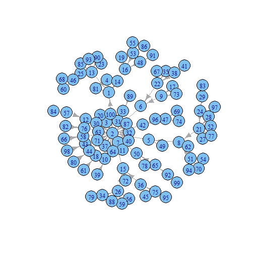
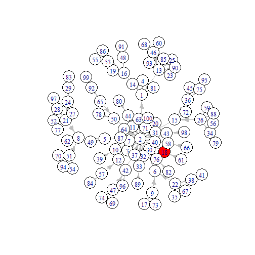

Simulating Network Diffusion with R
========================================================
width: 1200
font-family: 'Rockwell'
author: Cheng-Jun Wang
date: 06/03/2014


Introduction
========================================================
In this talk, I present how to simuate the most simple
network diffusion with R. The algorithm is quite simple:

- Generate a network g: g(V, E).
- Randomly select one or n nodes as seeds.
- Each infected node influences its neighbors with
probability p (transmission rate, β).

SI model
========================================================
Actually, this is the most basic epidemic model (SI model)
with only two states: Susceptible (S) and Infected (I)!
However, we will extend it to networks. Given the transmission
rate $\beta$, SI model can be described as: 

$\frac{dS}{dt}=-\beta SI$

$\frac{dI}{dt}=\beta SI$

Note that I + S = 1, the equation $\frac{dI}{dt}=-\beta SI$ can be simplified
as: $\frac{dI}{dt}=-\beta I(1-I)$

Solve this equation, we can get a logistic growth function featured
by its s-shaped curve.


Bring network back
========================================================


***


R and igraph
========================================================
R


***
igraph


To-do list
========================================================
- Set transmission rate
- Update graphs
- Generate networks
- Initiate the diffusers
- Start the contagion!
- Save as the animation

Set transmission rate
========================================================
Method 1

```r
transmission_rate = 0.4
coins = c(rep(1, transmission_rate*1000), rep(0,(1-transmission_rate)*1000))
n = length(coins)

toss = function(freq) {   # toss the coins
    tossing = NULL
    for (i in 1:freq ) tossing[i] = sample(coins, 1, replace=TRUE, prob=rep(1/n, times=n))
    tossing = sum(tossing)
    return (tossing)
  }
```


Set transmission rate (Updated)
========================================================
Method 2

```r
transmission_rate = 0.4
coins = c(1, 0) 
probabilities = c(transmission_rate, 1-transmission_rate )         
# sample(coins, 1, rep=TRUE, prob=probabilities) # Generate a sequence
# toss the coins
toss = function(freq) {
  tossing = NULL
  for (i in 1:freq ) tossing[i] = sample(coins, 1, rep=TRUE, prob=probabilities)
  tossing = sum(tossing)
  return (tossing)
}
```


Update graphs
========================================================


```r
update_diffusers = function(diffusers){
  nearest_neighbors = data.frame(table(unlist(neighborhood(g, 1, diffusers))))
  nearest_neighbors = subset(nearest_neighbors, !(nearest_neighbors[,1]%in%diffusers))
  keep = unlist(lapply(nearest_neighbors[,2], toss))
  new_infected = as.numeric(as.character(nearest_neighbors[,1][keep >= 1]))
  diffusers = unique(c(diffusers, new_infected))
  return(diffusers)
  }
```


Generate networks (Part 1)
========================================================
Set the node_number of social graph


```r
node_number = 100
library(igraph)
node_number
```

```
[1] 100
```


Generate regular networks

```r
g = graph.tree(node_number, children = 2)
g = graph.star(node_number)
g = graph.full(node_number)
g = graph.ring(node_number)
g = connect.neighborhood(graph.ring(node_number), 2)
```


Generate networks (Part 2)
========================================================

```r
g = erdos.renyi.game(node_number, 0.1)
g = rewire.edges( graph.ring(node_number), prob = 0.8 ) 
g = watts.strogatz.game(1,node_number,3,0.2) 
```


```r
g = barabasi.game(node_number) 
graph_name = "Scale-free network"
plot(g)
```

 


Initiate the diffusers (Part 1)
========================================================

```r
seed_num = 1
set.seed(20140301); diffusers = sample(V(g),seed_num)
infected =list()
infected[[1]]= diffusers
# set the color
E(g)$color = "grey"
V(g)$color = "white"
```


Initiate the diffusers (Part 2)
========================================================

```r
set.seed(2014); layout.old = layout.fruchterman.reingold(g, niter = 1000)
V(g)$color[V(g)%in%diffusers] = "red"
plot(g, layout =layout.old)
```

 


Start the contagion!
========================================================

```r
total_time = 1
while(length(infected[[total_time]]) < node_number){ 
  infected[[total_time+1]] = sort(update_diffusers(infected[[total_time]]))
  cat(length(infected[[total_time+1]]), "-->")
  total_time = total_time + 1
}
```

```
2 -->2 -->2 -->2 -->3 -->3 -->4 -->13 -->24 -->35 -->50 -->57 -->65 -->75 -->79 -->86 -->88 -->89 -->92 -->93 -->96 -->98 -->98 -->98 -->98 -->98 -->99 -->100 -->
```


Save as the animation (Part 1)
=========================================================

```r
plot_time_series = function(infected, m){
  num_cum = unlist(lapply(1:m, 
            function(x) length(infected[[x]]) ))
  p_cum = num_cum/node_number
  p = diff(c(0, p_cum))
  time = 1:m
  plot(p_cum~time, type = "b", 
       ylab = "CDF", xlab = "Time",
       xlim = c(0,total_time), ylim =c(0,1))
  plot(p~time, type = "h", frame.plot = FALSE,
       ylab = "PDF", xlab = "Time",
       xlim = c(0,total_time), ylim =c(0,1))
}
```


Save as the animation (Part 1)
=========================================================

```r
plot_time_series(infected, 16)
```

  


Save as the animation (Part 2)
=========================================================

```r
plot_gif = function(infected){
  m = 1
  while(m <= length(infected)){
    layout(matrix(c(1, 2, 1, 3), 2,2, byrow = TRUE), widths=c(3,1), heights=c(1, 1))
    V(g)$color = "white"
    V(g)$color[V(g)%in%infected[[m]]] = "red"
    plot(g, layout =layout.old, edge.arrow.size=0.2)
    title(paste(graph_name, "\n Transmission Rate =", transmission_rate, ", Day", m))
    plot_time_series(infected, m)
    m = m + 1}
}
```


Save as the animation (Part 3)
=========================================================

```r
library(animation)

saveGIF({
  ani.options(interval = 0.5, convert = shQuote("C:/Program Files/ImageMagick-6.8.8-Q16/convert.exe"))
  # start the plot
  plot_gif(infected)
}, ani.width = 800, ani.height = 500)
```


See the animation
==========================================================


This is the end!
==========================================================

[chengjun.github.io](http://chengjun.github.io)


***
Cheng-Jun Wang

- Web Mining Lab
- Department of Media and Communication
- City University of Hong Kong


